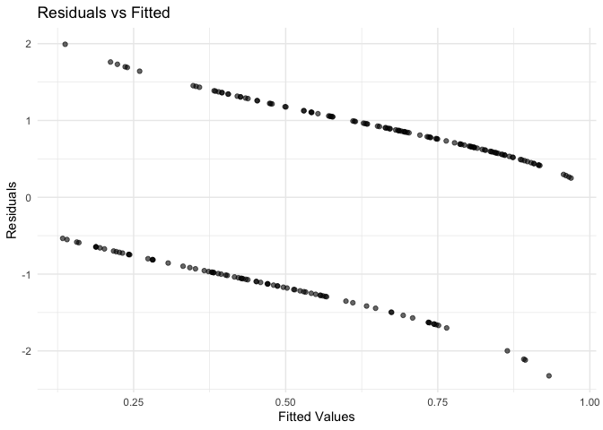
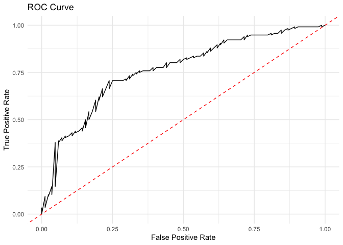
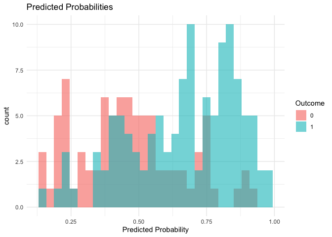

# SimpleLogistic

<!-- badges: start -->

[](https://app.codecov.io/gh/yanax726/Simple_Logistic)
<!-- badges: end -->

A simplified approach to logistic regression analysis in R, tailored for
health data science applications.

## Introduction

**SimpleLogistic** is an R package I developed to make logistic
regression easier, especially for those working with health data. It
provides functions for fitting logistic regression models, creating
diagnostic plots, and visualizing predicted probabilities. I hope this
package makes it easier for students and practitioners to perform
logistic regression without getting too bogged down in coding details.

## Features

- **Easy Model Fitting**: Quickly fit logistic regression models using a
  simple function.
- **Diagnostic Plots**: Generate basic diagnostic plots to check your
  model.
- **Prediction Visualization**: Plot predicted probabilities against
  actual outcomes.
- **Interaction Terms**: Easily include interaction terms in your
  models.
- **Compatibility with Base R**: Works smoothly with base R functions
  for further analysis.

## Installation

You can install **SimpleLogistic** from GitHub:

``` r
# Install devtools if you don't have it
install.packages("devtools")

# Install SimpleLogistic from GitHub
devtools::install_github("yourusername/SimpleLogistic")
```

## Getting Started

### Load the package and the example dataset:

``` r
library(SimpleLogistic)

# Load the example dataset
data("health_data")

# Look at the first few rows
head(health_data)
#>   outcome      age      bmi treatment
#> 1       1 44.39524 33.79524         A
#> 2       1 47.69823 30.24965         A
#> 3       1 65.58708 23.93942         B
#> 4       1 50.70508 27.17278         B
#> 5       0 51.29288 23.34264         A
#> 6       1 67.15065 23.09501         A
```

## Usage

### Fitting a Logistic Regression Model

Use the simple_logistic() function to fit a model:

``` r
# Fit the model
model <- simple_logistic(outcome ~ age + bmi + treatment, data = health_data)

# View the summary
summary(model$fit)
#> 
#> Call:
#> glm(formula = formula, family = binomial(), data = data)
#> 
#> Coefficients:
#>             Estimate Std. Error z value Pr(>|z|)    
#> (Intercept) -6.38664    1.52871  -4.178 2.94e-05 ***
#> age          0.09024    0.01989   4.536 5.74e-06 ***
#> bmi          0.11340    0.04185   2.710 0.006729 ** 
#> treatmentB  -1.14974    0.32451  -3.543 0.000396 ***
#> ---
#> Signif. codes:  0 '***' 0.001 '**' 0.01 '*' 0.05 '.' 0.1 ' ' 1
#> 
#> (Dispersion parameter for binomial family taken to be 1)
#> 
#>     Null deviance: 272.12  on 199  degrees of freedom
#> Residual deviance: 229.28  on 196  degrees of freedom
#> AIC: 237.28
#> 
#> Number of Fisher Scoring iterations: 4
```

### Generating Diagnostic Plots

Create diagnostic plots to assess the model:

``` r
# Generate diagnostic plots
plots <- diagnostic_plots(model)
#> Setting levels: control = 0, case = 1
#> Setting direction: controls < cases

# Residuals vs Fitted Values
print(plots$residuals_vs_fitted)
```



``` r

# ROC Curve
print(plots$roc_curve)
```



### Visualizing Predicted Probabilities

Plot the predicted probabilities:

``` r
# Plot predicted probabilities
plot_predictions(model)
#> Warning: Use of `data[[outcome_var]]` is discouraged.
#> ℹ Use `.data[[outcome_var]]` instead.
```

 \##
Advanced Usage \### Including Interaction Terms Include interaction
terms in the model:

``` r
# Fit a model with an interaction term
model_interaction <- simple_logistic(outcome ~ age * treatment + bmi, data = health_data)

# Summarize the model
summary(model_interaction$fit)
#> 
#> Call:
#> glm(formula = formula, family = binomial(), data = data)
#> 
#> Coefficients:
#>                Estimate Std. Error z value Pr(>|z|)    
#> (Intercept)    -6.76732    1.81287  -3.733 0.000189 ***
#> age             0.09876    0.02951   3.347 0.000818 ***
#> treatmentB     -0.38286    1.93841  -0.198 0.843426    
#> bmi             0.11244    0.04183   2.688 0.007181 ** 
#> age:treatmentB -0.01580    0.03943  -0.401 0.688687    
#> ---
#> Signif. codes:  0 '***' 0.001 '**' 0.01 '*' 0.05 '.' 0.1 ' ' 1
#> 
#> (Dispersion parameter for binomial family taken to be 1)
#> 
#>     Null deviance: 272.12  on 199  degrees of freedom
#> Residual deviance: 229.12  on 195  degrees of freedom
#> AIC: 239.12
#> 
#> Number of Fisher Scoring iterations: 4
```

### Making Predictions on New Data

Predict outcomes for new data:

``` r
# New data for prediction
new_data <- data.frame(
  age = c(35, 45, 55),
  bmi = c(24, 28, 31),
  treatment = c("A", "B", "A")
)

# Predict probabilities
new_data$predicted_prob <- predict(model$fit, newdata = new_data, type = "response")

# View predictions
print(new_data)
#>   age bmi treatment predicted_prob
#> 1  35  24         A      0.3759883
#> 2  45  28         B      0.4254698
#> 3  55  31         A      0.8901211
```

### Comparing with Base R Functions

Check that the results are consistent with base R’s glm() function:

``` r
# Fit a model using glm()
model_glm <- glm(outcome ~ age + bmi + treatment, data = health_data, family = binomial())

# Compare coefficients
all.equal(coef(model$fit), coef(model_glm))
#> [1] TRUE
```

## Dataset

The package includes a simulated dataset health_data with:

- **outcome:** Binary outcome variable (0 or 1)
- **age:** Age in years
- **bmi:** Body Mass Index
- **treatment:** Treatment group (“A” or “B”) You can load it using:

``` r
data("health_data")
```

## Dependencies

SimpleLogistic uses the following R packages: - **ggplot2** for
plotting. - **pROC** for ROC curve analysis. You can install them with:

``` r
install.packages(c("ggplot2", "pROC"))
```

## Contributing

If you have suggestions or find any issues, feel free to open an issue
or pull request on GitHub.

## License

This project is licensed under the MIT License.

I hope SimpleLogistic is helpful for your logistic regression analyses,
especially if you’re just getting started with R and statistical
modeling.

For more examples and detailed usage, check out the package vignette:

``` r
browseVignettes("SimpleLogistic")
```
